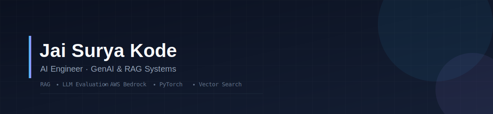

  

  

  
  
  

---

### Currently building

- Exploring agentic workflows and multi-step LLM orchestration with LangGraph
- Sharpening evaluation pipelines for RAG systems (RAGAS, hallucination scoring)
- Open to Applied AI, ML Engineering, and GenAI/RAG roles — always happy to talk shop

---

### About Me

- M.S. in Artificial Intelligence, Northeastern University (GPA 3.91/4)
- 3.5+ years across NLP, LLMs, and computer vision — from research (Sanskrit-based embeddings) to production (grant-writing copilots)
- Shipped systems that cut task time by 70% and reduced hallucinations by 40%

---

### Tech Stack

**GenAI & LLM**

**ML / DL**

**Cloud & Infra**

**Languages & Backend**

---

### Featured Projects

<table>
<tr>
<td width="50%">

**[GrantWell — AI Grant-Writing Platform](https://github.com/KodeJaiSurya)**
RAG-powered assistant on AWS Bedrock + Claude 3.5, serving 500+ users across 50+ municipalities. Cut grant prep time by 70% and doubled successful submissions.

</td>
<td width="50%">

**[Channel-Adaptive ViT for Microscopy](https://github.com/KodeJaiSurya)**
Channel-agnostic Vision Transformer generalizing across biological datasets with 3–5 channels. Trained on 220K+ images, 95.31% accuracy, ~40% faster training.

</td>
</tr>
<tr>
<td width="50%">

**[Course Planning Copilot](https://github.com/KodeJaiSurya)**
RAG system (LangGraph + GPT-4o + pgvector) unifying course catalogs and reviews for sub-second, natural-language academic planning.

</td>
<td width="50%">

**[Vibify — Emotion-Based Music Recommender](https://github.com/KodeJaiSurya)**
Real-time facial sentiment analysis driving intelligent, mood-aware music recommendations.

</td>
</tr>
</table>

---

<picture>
  <source media="(prefers-color-scheme: dark)" srcset="https://raw.githubusercontent.com/KodeJaiSurya/KodeJaiSurya/output/github-contribution-grid-snake-dark.svg">
  <source media="(prefers-color-scheme: light)" srcset="https://raw.githubusercontent.com/KodeJaiSurya/KodeJaiSurya/output/github-contribution-grid-snake.svg">
  
</picture>

---

<i>Open to Applied AI, ML Engineering, and GenAI/RAG roles — let's connect!</i>

